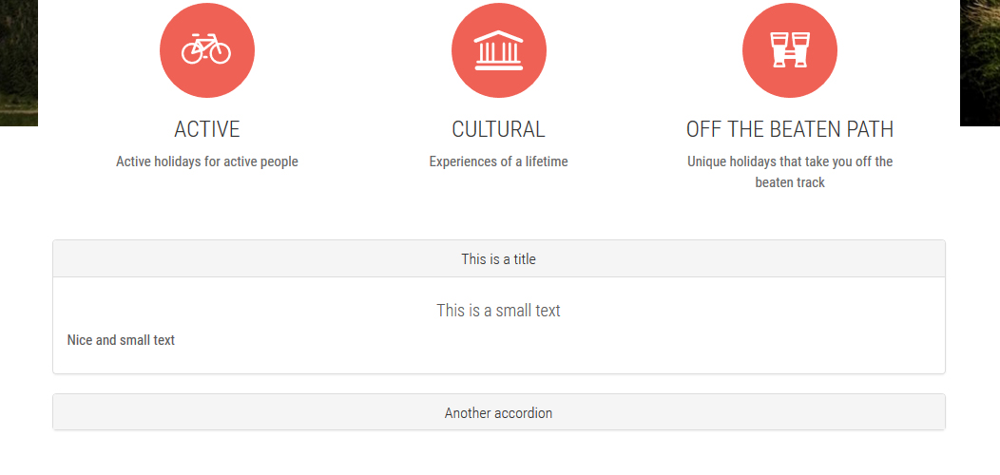
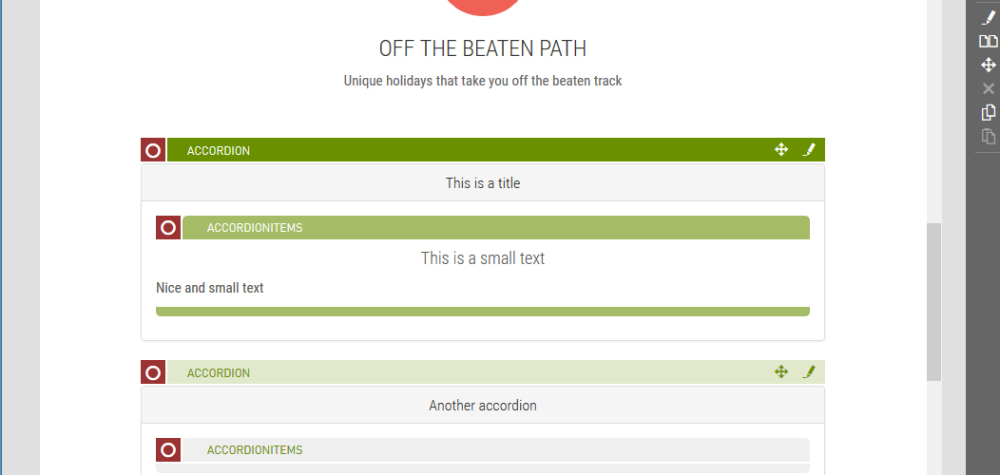
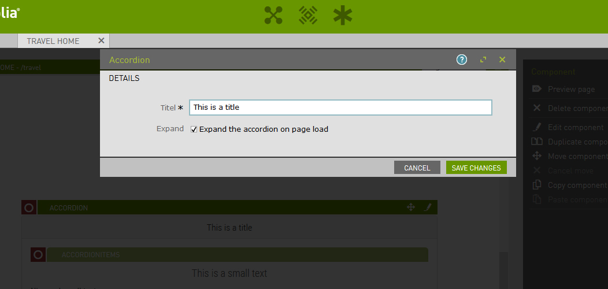

# Shareable - Accordion Component for Magnolia CMS

> This is a simple accordion component based on the touristic demo of magnolia. All CSS and Javascript is based on Bootstrap.

## Features
> You can add a title and check if the accordion should be expanded on page load. You can add multiple other components inside.

## Usage
> You can use this component by simple adding it to any area you want. If you use the travel-demo it is directly decorated on the home page main area.

## Information on Magnolia CMS
This directory is a Magnolia 'light module'.

https://docs.magnolia-cms.com

Search the docs for `sharing light modules` for details on how to share and use light modules on npm and github.

## Contribute to the Magnolia component ecosystem
It's easy to create components for Magnolia and share them on github and npm. I invite you to do so and join the community. Let's stop wasting time by developing the same thing again and again, rather let's help each other out by sharing our work and create a rich library of components.

Just add `magnolia-light-module` as a keyword to npm's package.json to make them easy to find and use on npm.

## License

MIT

## Contributors

Marvin Kerkhoff
